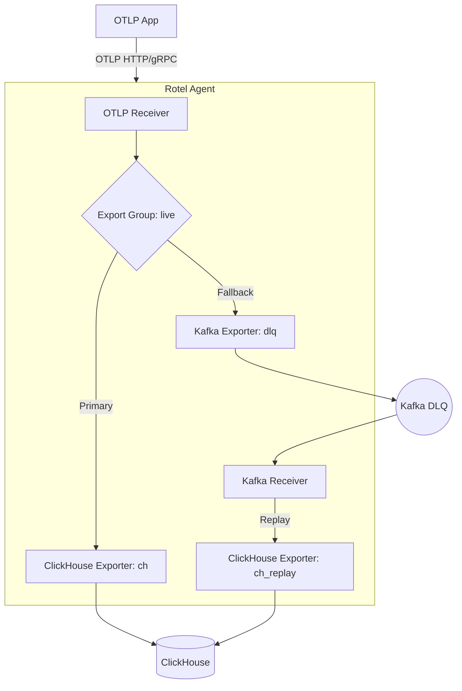

# Rotel Fallback DLQ Example

This example demonstrates how to configure Rotel for high availability using a Kafka-based Dead Letter Queue (DLQ) for fallback and automatic recovery.

## What this demonstrates

1.  **Normal Path**: OTLP data is received by Rotel and exported directly to ClickHouse.
2.  **Fallback Path**: When ClickHouse is unavailable, Rotel automatically falls back to exporting data to Kafka (the DLQ).
3.  **Recovery Path**: The same Rotel process consumes from the Kafka DLQ and replays the data to ClickHouse once it's back online.

## Architecture



### Why `ch_replay` exists

Rotel's Kafka receiver supports offset tracking, which ensures that messages are only committed after they have been successfully exported. However, to prevent data loss during recovery, Kafka receiver targets are configured to retry indefinitely. 

Rotel validation rules prohibit an exporter from being both a member of an export group (which has its own failover logic) and a target of a Kafka receiver with offset tracking. To work around this, we define two logical exporters:
- `ch`: The primary member of the `live` export group.
- `ch_replay`: The target for the Kafka recovery receiver.

Both point to the same physical ClickHouse endpoint.

## Prerequisites

- [Docker](https://docs.docker.com/get-docker/) with Compose plugin.
- [mise](https://mise.jdx.sh/) task runner.
- Rust toolchain (to build Rotel).

## Runbook

Follow this flow to see fallback and recovery in action.

```bash
cd examples/fallback-dlq
mise run reset
mise run up
mise run build
mise run ddl
```

In terminal 1, start Rotel. This stays in the foreground so you can watch fallback and replay logs.

```bash
mise run rotel:start
```

In terminal 2, send data while ClickHouse is healthy and verify it landed in ClickHouse.

```bash
mise run send
mise run verify:clickhouse
```

Stop ClickHouse, send more data, then verify Kafka received the fallback data.

```bash
mise run clickhouse:stop
mise run send
mise run verify:kafka
```

Observe the Rotel logs. You should see ClickHouse export errors and Rotel falling back to the `dlq` (Kafka) exporter. The Kafka receiver will also start attempting to replay this data but will be held in a retry loop because ClickHouse is down.

Restart ClickHouse, wait for replay, then verify ClickHouse row counts and Kafka consumer offsets.

```bash
mise run clickhouse:start
sleep 10
mise run verify:clickhouse
mise run verify:kafka
```

To stop containers but keep data:

```bash
mise run down
```

To stop containers and remove data/offsets:

```bash
mise run reset
```

## Troubleshooting

- **Config Rejected**: If Rotel fails to start with a configuration error, ensure that `ROTEL_KAFKA_RECEIVER_TARGET_EXPORTERS_*` points to `ch_replay` and NOT `ch`.
- **Missing Tables**: If ClickHouse inserts fail, ensure you ran `mise run ddl`.
- **Kafka Connection**: If Rotel cannot connect to Kafka, check `KAFKA_ADVERTISED_LISTENERS` in `docker-compose.yml` exposes `localhost:9092`.
